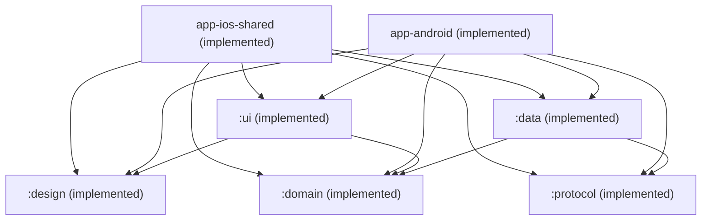

# Dpad Architecture

## Modules

| Module | Status | Purpose |
|---|---|---|
| `:domain` | ✅ Implemented | Pure Kotlin. Models (`PairedDevice`, `DiscoveredDevice`, `RemoteKey`, `Shortcut`, `ConnectionState`, `PairingProgress`, `ClientIdentityHandle`) and contracts (`DeviceRepository`, `ShortcutRepository`, `RemoteController`, `DevicePairer`, `DeviceDiscovery`, `ClientIdentityStore`). Curated shortcut catalog constant. `jvm()` target. No `:protocol` dependency — depends on abstract contracts only. Standalone: nothing in `:domain` depends on any other Dpad module. |
| `:protocol` | ✅ Implemented | Standalone Android TV Remote v2 library module — no dependency on `:domain` or app code. Wire-generated protobuf messages, length-prefixed framing, pairing state machine, remote session state machine, mDNS discovery, and the three expect/actual seams (TlsSocketFactory, sha256, DerX509). `jvm()` + `iosArm64()` + `iosSimulatorArm64()` targets. |
| `:data` | ✅ Implemented | Implements `:domain` contracts by wiring `:protocol` to persistence (DataStore). Depends on `:domain` and `:protocol`. DataStore-backed `DeviceRepository`/`ShortcutRepository`/`ClientIdentityStore`, pure protocol mappers, and thin discovery/pairing/remote-control adapters over `:protocol`. Exposes a Koin `dataModule`; the app modules (Plan 3) supply the platform-specific `DataStore<Preferences>`, `MdnsBrowser`, and a `named("session")` `CoroutineScope`. |
| `:design` | ✅ Implemented | Design system: `DpadTheme` + reusable remote-control primitives (`DirectionalPad`, `RemoteIconButton`, `ShortcutChip`). Compose Multiplatform. Depends on Compose only — no `:domain`/`:data`/`:protocol`. `jvm()` + `android()` + `iosArm64()` + `iosSimulatorArm64()` targets. |
| `:ui` | ✅ Implemented | All Dpad screens (`RemoteScreen`, `DevicesScreen` + pairing sheet, `ShortcutsScreen`) and their ViewModels — the tiny-app single-UI-module collapse — plus the Navigation-3 `AppNavHost` back stack (Remote root; Devices/Shortcuts pushed). Depends on `:design` and `:domain`; ViewModels consume `:domain` contracts via Koin and never touch `:data`/`:protocol`. ViewModels are host-tested (`testAndroidHostTest`, Robolectric-free JVM tests). `jvm()` + `android()` + `iosArm64()` + `iosSimulatorArm64()` targets. |
| `app-android` | ✅ Implemented | Android application module. Edge-to-edge entry point + Koin composition root providing the DataStore path, Context-bearing `MdnsBrowser`, and the `SupervisorJob` + main-confined `named("session")` `CoroutineScope`. The only module that sees `:data`/`:protocol` directly on Android; assembles to a debug APK (`:app-android:assembleDebug`). |
| `app-ios-shared` | ✅ Implemented | iOS analog of `app-android`: the app-layer composition root allowed to see both `:ui` and `:data`. No `jvm()`/`android()` targets — exists solely to be linked as a static `DpadShared` framework consumed by the Xcode project in `app-ios/`. Hosts `ComposeUIViewController` rendering `:design`'s `DpadTheme` + `:ui`'s `AppNavHost`, and the iOS platform Koin module. Both iOS archs (`iosArm64`, `iosSimulatorArm64`) link. |
| `app-ios` | ✅ Implemented (Xcode build is manual) | Thin iOS entry point: XcodeGen `project.yml` + SwiftUI entry committed, `.xcodeproj` gitignored (`cd app-ios && xcodegen generate`, then build/run in Xcode or via `xcodebuild`). Links `app-ios-shared`'s `DpadShared` framework. Not a Gradle module. |

## Dependency Graph

**Key:** `:domain` and `:protocol` are independent, standalone modules; `:data` depends on both — it implements `:domain`'s contracts (`DeviceRepository`, `ShortcutRepository`, `ClientIdentityStore`, `DeviceDiscovery`, `DevicePairer`, `RemoteController`) using `:protocol` (mDNS discovery, pairing, remote session) and DataStore persistence, and wires the bindings together in a Koin `dataModule`. `:design` depends on Compose Multiplatform only. `:ui` depends on `:design` and `:domain` — it never sees `:data`/`:protocol` directly, so screens and ViewModels are testable without the protocol/persistence layer. The two app modules (`app-android`, `app-ios-shared`) are the composition roots: each is the only place in its platform that wires `:ui`/`:design`/`:domain` together with `:data`/`:protocol`, supplying the platform-specific `DataStore<Preferences>`, `MdnsBrowser`, and session `CoroutineScope` that `:data`'s Koin module requires. `app-ios` is the non-Gradle Xcode project that links `app-ios-shared`'s framework.
