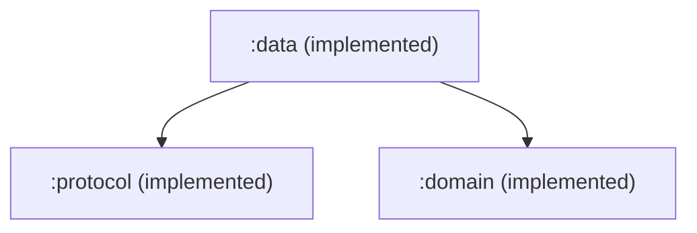

# Dpad Architecture

## Modules

| Module | Status | Purpose |
|---|---|---|
| `:domain` | ✅ Implemented | Pure Kotlin. Models (`PairedDevice`, `DiscoveredDevice`, `RemoteKey`, `Shortcut`, `ConnectionState`, `PairingProgress`, `ClientIdentityHandle`) and contracts (`DeviceRepository`, `ShortcutRepository`, `RemoteController`, `DevicePairer`, `DeviceDiscovery`, `ClientIdentityStore`). Curated shortcut catalog constant. `jvm()` target. No `:protocol` dependency — depends on abstract contracts only. Standalone: nothing in `:domain` depends on any other Dpad module. |
| `:protocol` | ✅ Implemented | Standalone Android TV Remote v2 library module — no dependency on `:domain` or app code. Wire-generated protobuf messages, length-prefixed framing, pairing state machine, remote session state machine, mDNS discovery, and the three expect/actual seams (TlsSocketFactory, sha256, DerX509). `jvm()` + `iosArm64()` + `iosSimulatorArm64()` targets. |
| `:data` | ✅ Implemented | Implements `:domain` contracts by wiring `:protocol` to persistence (DataStore). Depends on `:domain` and `:protocol`. DataStore-backed `DeviceRepository`/`ShortcutRepository`/`ClientIdentityStore`, pure protocol mappers, and thin discovery/pairing/remote-control adapters over `:protocol`. Exposes a Koin `dataModule`; the app modules (Plan 3) supply the platform-specific `DataStore<Preferences>`, `MdnsBrowser`, and a `named("session")` `CoroutineScope`. |
| `:design` | Plan 3 | Design system: theme + remote-control primitives (circular d-pad composable, pill buttons, button grid). |
| `:remote` | Plan 3 | Main remote screen feature (d-pad, buttons, shortcut row, text-input sheet, connection banner). |
| `:devices` | Plan 3 | Device list (paired + discovered), pairing flow with code entry, device switcher. |
| `:shortcuts` | Plan 3 | Shortcut editor (catalog picker, custom entry, reorder/delete). |
| `app-android` | Plan 3 | Thin Android entry point + Koin composition root. |
| `app-ios` | Plan 3 | Thin iOS entry point (XcodeGen `project.yml` + Swift entry committed, `.xcodeproj` gitignored) + Koin composition root. |

## Dependency Graph

**Key:** `:domain` and `:protocol` are independent, standalone modules; `:data` depends on both — it implements `:domain`'s contracts (`DeviceRepository`, `ShortcutRepository`, `ClientIdentityStore`, `DeviceDiscovery`, `DevicePairer`, `RemoteController`) using `:protocol` (mDNS discovery, pairing, remote session) and DataStore persistence, and wires the bindings together in a Koin `dataModule`.
