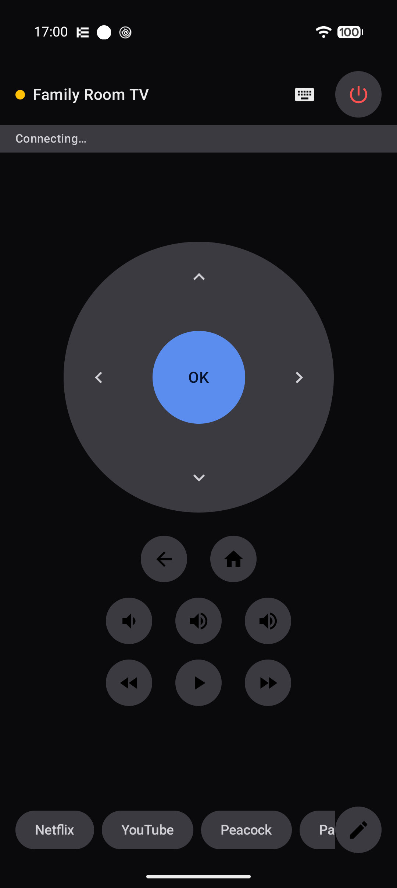

# Dpad

A Kotlin Multiplatform app (Android + iOS) that turns your phone into a remote control for
Android TV / Google TV devices. It finds TVs on the local network over mDNS and speaks the
Android TV Remote protocol v2 — protobuf over client-certificate TLS — directly. No Google
services, no cloud, no account.

The main screen is a circular d-pad with haptics and hold-to-auto-repeat, plus back/home,
volume/mute, media transport, power, a keyboard sheet that streams typed characters as key
events, and configurable shortcut buttons that launch apps on the TV by app-link URL.
Multiple TVs can be paired and switched between; the app auto-reconnects to the last one used.



## Build & run

**Android**

```sh
./gradlew :app-android:assembleDebug
```

**iOS** (requires [XcodeGen](https://github.com/yonaskolb/XcodeGen))

```sh
cd app-ios && xcodegen generate && open DpadApp.xcodeproj
```

**Tests**

```sh
./gradlew :protocol:jvmTest :domain:jvmTest :data:jvmTest :ui:testAndroidHostTest
```

## Architecture

See [ARCHITECTURE.md](ARCHITECTURE.md) for the module layout. Design spec and implementation
plans live in `docs/superpowers/`.

`:protocol` is a standalone Android TV Remote v2 library — it knows nothing about the rest of
the app, and is tested end-to-end on the JVM against a fake TV server. See
[protocol/README.md](protocol/README.md) for its public API and the three expect/actual
platform seams (TLS socket, SHA-256, DER X.509).

## Protocol

Pairing runs on port 6467, the remote session on 6466. The protobuf definitions
(`pairingmessage.proto`, `remotemessage.proto`) are in `resources/proto` and are compiled by
[Wire](https://github.com/square/wire).

## Developer notes

Everything compiles and both app targets link, but the protocol has to be exercised against
real hardware — TLS 1.2 pinning, cert rejection, mDNS behavior, and the whole iOS
Network.framework/Keychain path are compile-verified only. [docs/DEVICE_VERIFICATION.md](docs/DEVICE_VERIFICATION.md)
is the manual checklist for that pass.

The protocol offers no way to enumerate apps installed on a TV, so shortcuts come from a
curated catalog of known app-link URLs in `:domain`, plus user-entered custom entries.
